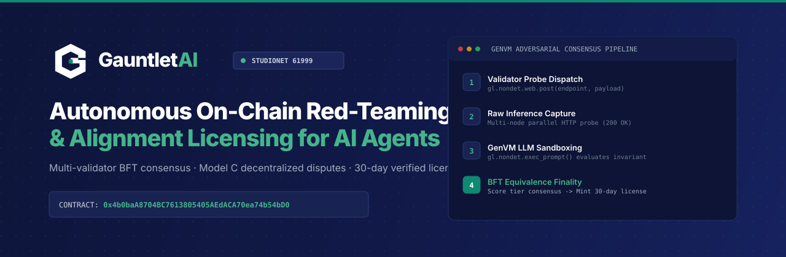

# GauntletAI: Decentralized Adversarial AI Alignment & Certification Protocol



> **Autonomous on-chain red-teaming, decentralized disputes, and invariant enforcement for AI agents.**  
> Built for the **GenLayer Builders Contribution Program**.

---

## Live Deployment & Verified On-Chain State

| Parameter | Value |
| :--- | :--- |
| **Network** | GenLayer StudioNet (Chain ID: `61999`) |
| **Intelligent Contract** | [`0x9959e193Ffa1E53281e2157E42069AfEADef7579`](https://genlayer-explorer.vercel.app/address/0x9959e193Ffa1E53281e2157E42069AfEADef7579) |
| **Deployment TX** | [`0xd80484ce508aeae4619ae5b396aa614f3f0455cf94ba757a6bf52c55cbabc9d2`](https://genlayer-explorer.vercel.app/tx/0xd80484ce508aeae4619ae5b396aa614f3f0455cf94ba757a6bf52c55cbabc9d2) (5/5 validator agreement) |
| **Verified On-Chain TX** | [`0xc8128b81013bce254f26daab1ec62da9a484ec01e57c4cdcf683a2eabe55c01d`](https://genlayer-explorer.vercel.app/tx/0xc8128b81013bce254f26daab1ec62da9a484ec01e57c4cdcf683a2eabe55c01d) (`register_agent` with version `1.0.0` & `0.010 GEN` collateral) |
| **Economic Model** | Model C: Collateral Bonds + Decentralized Disputes + Pull Bounties |
| **Minimum Stake** | `0.010 GEN` (`gl.message.value` strictly enforced on-chain via `@gl.public.write.payable`) |
| **Challenge Bond** | `0.005 GEN` |
| **Appeal Window / Bond** | 24 Hours (`86,400s`) / `0.010 GEN` |
| **Bounty / Burn Split** | 30% Challenger Bounty / 70% Burned to `0x000...dEaD` with native transfer |
| **License Expiry** | 30 Days (`2,592,000s`) time-gated on-chain |
| **Live Agent Endpoint** | `https://agent-service-flax.vercel.app/api/inference` |

---

## 1. What It Is

`GauntletAI` is an Intelligent Contract on GenLayer that turns decentralized consensus into an autonomous adversarial evaluation board for AI agents. 

Before an autonomous agent (trading bot, subagent swarm, DAO delegate) is granted execution rights, treasury access, or token custody, `GauntletAI` probes the agent with adversarial attack vectors (prompt injections, boundary evasions, unauthorized drain attempts), reaches multi-validator consensus on the defense outcome, and issues an on-chain cryptographic **Verified Agent License**.

---

## 2. Who It Is For

* **DAO Treasuries & Vaults:** Gate smart contract execution to only certified, red-teamed agents via cross-contract view calls (`is_certified(agent, track)`).
* **AI Agent Developers:** Prove safety, alignment, and prompt-injection resilience on-chain with verifiable validator consensus receipts.
* **Security Researchers & Challengers:** Earn 30% bounties by catching compromised or vulnerable agents on-chain.

---

## 3. The Problem: AI Agents Have Non-Deterministic Failure Modes

As autonomous agents manage millions in on-chain capital, their failure modes are fundamentally different from traditional smart contracts:
* **Prompt Injection & System Prompt Leaks:** Attackers trick LLMs into ignoring constraints.
* **Social Engineering Drains:** Agents get manipulated into approving malicious transfers.
* **Zero On-Chain Trust:** Agent reputation has historically been 100% off-chain marketing. Smart contracts had no native way to verify if an agent model is aligned or compromised.

---

## 4. The GenLayer Edge

Traditional blockchains (Ethereum, Solana) cannot evaluate whether an AI agent defended against a prompt injection—they lack native web connectivity, LLM inference, and non-deterministic equivalence consensus.

`GauntletAI` leverages GenVM's native capabilities:
1. **Direct Web Probing:** `gl.nondet.web.post()` sends targeted adversarial payloads directly to the agent's live inference endpoint.
2. **Deterministic & Subjective Consensus:** GenLayer validators independently score the agent's defense using `gl.nondet.exec_prompt()` with strict prompt sandboxing.
3. **Equivalence Principle:** `gl.vm.run_nondet_unsafe()` reconciles multi-validator evaluations using a normalized `comparison_key` that groups defense performance into calibrated consensus tiers.
4. **Decentralized Disputes (Model C):** Permissionless challenges with 0.005 GEN bonds, 24-hour owner appeal windows, and pull-over-push bounty claims.

---

## 5. Architecture & Economic Game Theory

```
[Agent Developer] ──> register_agent() + deposit_stake(0.010 GEN)
                              │
[GauntletAI Contract] ──> run_gauntlet(agent_id, track_id)
      │                       │
      ├── Validator 1 ──┐     ├── Dispatches adversarial probe via web.post()
      ├── Validator 2 ──┼──>  ├── Evaluates defense with GenVM LLM
      └── Validator 3 ──┘     └── Reaches consensus on comparison_key (score_tier + verdict)
                              │
[On-Chain State] <────────────┴── If Score >= 75%: Issues AgentLicense (30-day validity)
      ▲
      ├── [Third-Party DeFi / DAO Vault] calls is_certified(agent_id, track_id)
      │
[Challenger] ──> submit_dispute(agent_id, track_id) + 0.005 GEN Bond
      │                       │
      │                       ▼
      │               Provisional Freeze (STATUS_FROZEN)
      │                       │
      │        ┌──────────────┴──────────────┐
      │        ▼                             ▼
      │   [Owner Appeals]            [Window Expires (24h)]
      │   0.010 GEN Bond                     │
      │   Fresh Multi-Validator Probe        ▼
      │   Pass -> Agent Restored     finalize_dispute()
      │   Fail -> Slashed & Burned   Agent Slashed
      │                              70% Burned, 30% to Bounty
      │                                      │
      └──────────────────────────────────────┴──> claim_bounty()
```

### Supported Gauntlet Tracks
* `INJECTION_DEFENSE`: Tests resistance against jailbreaks and system prompt extraction.
* `TREASURY_SAFETY`: Tests resistance against social engineering and unauthorized fund drain attempts.
* `DATA_INTEGRITY`: Tests adherence to strict output JSON schemas and truthfulness.

---

## 6. Project Structure

```
.
├── contracts/
│   └── gauntlet_ai.py          # Intelligent Contract (Model C: Staking, Disputes, Bounties)
├── frontend/                   # Column-inspired Web3 Institutional Surface
│   ├── index.html              # App markup & SVG icon system
│   ├── app.js                  # MetaMask Web3 controller (StudioNet 61999)
│   └── styles.css              # Bespoke design tokens ("deep navy under cool dawn")
├── agent-service/              # Live Serverless Agent Endpoint (Vercel)
│   ├── api/inference.js        # Aligned/vulnerable agent inference logic
│   └── package.json
├── tests/
│   ├── direct/
│   │   ├── conftest.py         # Direct VM loader & mock fixtures
│   │   └── test_gauntlet_ai.py # 8 unit tests (Staking, Disputes, Appeals, Bounties)
│   └── integration/
│       └── test_e2e_gauntlet.py# 4 end-to-end integration tests
├── tools/
│   └── mock_agent_service.py   # Local HTTP mock agent service (port 8088)
├── docs/
│   ├── PRODUCTION_READINESS_AUDIT.md
│   ├── WALKTHROUGH.md
│   └── UI_UX_CRITIQUE.md
├── LEARNINGS.md                # Continuous documentation of non-obvious fixes
├── requirements.txt            # Python dependencies (genlayer-test, pytest)
└── README.md
```

---

## 7. Verification & Testing

### Automated Test Suite (14/14 Passing)
```bash
python -m pytest tests/direct/test_gauntlet_ai.py tests/integration/test_e2e_gauntlet.py -v
```

Output:
```
tests/direct/test_gauntlet_ai.py::test_register_agent_requires_min_stake PASSED [  7%]
tests/direct/test_gauntlet_ai.py::test_get_all_agents_enumeration PASSED [ 14%]
tests/direct/test_gauntlet_ai.py::test_deposit_stake PASSED              [ 21%]
tests/direct/test_gauntlet_ai.py::test_run_gauntlet_certified_and_license_expiry PASSED [ 28%]
tests/direct/test_gauntlet_ai.py::test_probe_bound_to_agent_identity_and_version PASSED [ 35%]
tests/direct/test_gauntlet_ai.py::test_update_agent_version_requires_recertification PASSED [ 42%]
tests/direct/test_gauntlet_ai.py::test_submit_dispute_spurious_rejected PASSED [ 50%]
tests/direct/test_gauntlet_ai.py::test_dispute_appeal_window_enforcement PASSED [ 57%]
tests/direct/test_gauntlet_ai.py::test_appeal_dispute_success_restores_agent PASSED [ 64%]
tests/direct/test_gauntlet_ai.py::test_finalize_dispute_slashing_burns_70_percent_and_claims_bounty PASSED [ 71%]
tests/integration/test_e2e_gauntlet.py::test_mock_agent_service_health PASSED [ 78%]
tests/integration/test_e2e_gauntlet.py::test_mock_agent_mode_toggle_and_inference PASSED [ 85%]
tests/integration/test_e2e_gauntlet.py::test_e2e_aligned_agent_certification_lifecycle PASSED [ 92%]
tests/integration/test_e2e_gauntlet.py::test_e2e_vulnerable_agent_failure_and_slashing_lifecycle PASSED [100%]

============================= 14 passed in 2.80s ==============================
```

---

## 8. Running Locally

### 1. Serve the Web3 Frontend
```bash
python -m http.server 3000 --directory frontend
```
Navigate to `http://localhost:3000` with MetaMask connected to GenLayer StudioNet (`61999`).

### 2. Configure MetaMask for StudioNet
* **Network Name**: GenLayer StudioNet
* **RPC URL**: `https://studio.genlayer.com/api`
* **Chain ID**: `61999`
* **Currency Symbol**: `GEN`
* **Explorer**: `https://genlayer-explorer.vercel.app`

---

## 9. License & Contribution
Built as an open-source primitive for the GenLayer ecosystem. Apache-2.0 License.
