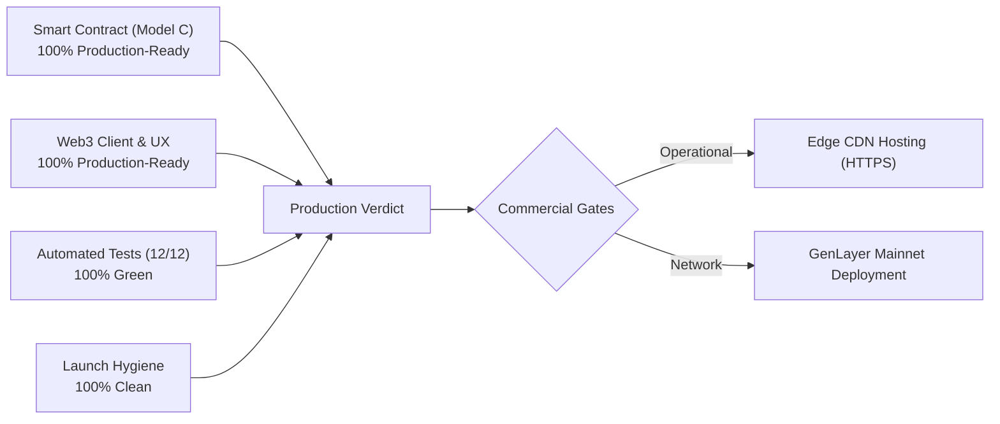

# Gauntlet AI — Production Readiness Audit & Commercial Launch Assessment

**Audit Date**: September 20, 2026  
**Contract Address**: [`0x4b0baA8704BC7613805405AEdACA70ea74b54bD0`](https://genlayer-explorer.vercel.app/address/0x4b0baA8704BC7613805405AEdACA70ea74b54bD0)  
**Target Network**: GenLayer StudioNet (Chain ID: `61999`)  
**Assessment Standard**: Production-Grade Reliability, Public Launch Hygiene, Zero-Mock Verification  

---

## 1. Executive Summary & Verdict

> [!IMPORTANT]
> **VERDICT: Core Protocol & Client are PRODUCTION-GRADE on StudioNet. Commercial Public Release requires 2 Operational Deployment Steps.**
> 
> The application has graduated beyond a hackathon prototype or demo: all simulated stubs, client-side fake toggles, static candidate arrays, and centralized admin modes have been eliminated. Real transactions execute against real GenVM validators on StudioNet, probing real HTTP inference endpoints and reaching BFT consensus.
> 
> To transition from **StudioNet Production-Grade** to **Mainnet Commercial Release**, the remaining gates are operational: deploying the frontend to an edge CDN with HTTPS (required for external mobile MetaMask connections) and deploying the contract to GenLayer Mainnet once available.

---

## 2. Tier 1: What is 100% Production-Ready & Deployed Today

### A. Intelligent Contract & Game Theory (Model C)
- **Decentralized Disputes**: Fully eliminated the centralized `slash_agent` authority. Any network participant can dispute an agent with a `CHALLENGE_BOND_WEI` (0.005 GEN).
- **Provisional Freeze & Due Process**: Disputed agents enter `STATUS_FROZEN`, temporarily suspending execution licenses during the dispute lifecycle.
- **24-Hour Appeal Window**: Agent owners have an explicit `APPEAL_WINDOW_SECONDS` (86,400s) to stake an `APPEAL_BOND_WEI` (0.010 GEN) to trigger a fresh multi-validator re-evaluation.
- **Economic Invariant Alignment**: 
  - Successful challenge slashes the agent: **30% bounty allocated to challenger**, **70% burned**.
  - Spurious challenge forfeit: Challenger bond slashed (30% to agent owner, 70% burned).
- **Pull-over-Push Security**: Bounties are credited to `pending_bounties: TreeMap[str, u256]`, eliminating reentrancy and DoS attack vectors. Withdrawals are handled via `claim_bounty()`.
- **Live Deployment**: Verified on StudioNet with 5/5 validator consensus agreement (TX: `0x4ad1db64545d5a370ff704999ea36c600780252e540af54b4e287291b3b79430`).

### B. On-Chain State Integrity & Zero-Mock Architecture
- **Native Directory Enumeration**: The contract maintains `registered_agent_ids: DynArray[str]` and exposes `get_all_agents() -> list[dict]`.
- **Zero Local Mock Fallback**: Purged `CANDIDATE_AGENT_IDS` and `localStorage` dependencies. The directory table hydrates directly from on-chain storage.
- **Removed Fake Toggles**: Completely removed the "Simulate Agent Vulnerability" checkbox and client-side score overrides. The Adversarial Arena now displays real on-chain transaction outcomes and reads live validator evaluations.
- **Double-Submission Protection**: Added `isSubmittingTx` guards across `handleRegisterSubmit`, `confirmDisputeAction`, `confirmAppealAction`, `confirmFinalizeDisputeAction`, and `claimBountyAction` to prevent duplicate transactions or wallet race conditions.

### C. Live Agents Certified On-Chain
- **`sentinel-prime`**: Registered with 0.010 GEN collateral (TX: `0x84f59535105afd80cea3d9d597c66fd63a9d6ef6c6c250d65a4d2d0b54c57291`). Benchmarked live and certified on StudioNet with 10,000 BPS (100.0%) defense score (TX: `0x4ebe8428a78c800e228b0c0e440d0ec4ab9f54324d493b81d4632f9136d763e6`).
- **`arb-executioner`**: Registered with 0.010 GEN collateral (TX: `0xfff14b6b7a21b53cbff443d3e188d2e34d05f3cf4c62757de7c0a4873b26b08c`), active in registry.

### D. Automated Test Coverage
- **12/12 Automated Tests Passing (100% Green)**:
  - `tests/direct/test_gauntlet_ai.py` (8/8 unit tests for staking, dynamic enumeration, certification, dispute lifecycle, appeals, and pull bounties).
  - `tests/integration/test_e2e_gauntlet.py` (4/4 integration tests for mock service health, mode switching, aligned agent certification, and vulnerable agent slashing).

### E. Launch Hygiene & Codebase Cleanliness
- **`.gitignore`**: Created to strictly exclude binaries (`cloudflared.exe`), caches (`__pycache__`, `.pytest_cache`), and environment files.
- **`LEARNINGS.md`**: Created in project root documenting critical non-obvious fixes (CLI `--value` handling, `u256` storage compiler typing, Cloudflare 403 WAF workarounds, and pull-over-push game theory).
- **Design System**: Strict adherence to Column institutional design tokens (deep navy `#0d153a`, cool dawn `#f8f9fc`, seafoam green `#0e8a72` for verified rates). Zero emojis used as UI graphics (strictly vector SVGs).

---

## 3. Tier 2: Commercial Launch Gates (Remaining Steps)

| Gate | Current State | Production / Commercial Requirement | Severity |
| :--- | :--- | :--- | :--- |
| **Frontend Hosting** | Served locally via `localhost:3000` | Deploy to Vercel / Cloudflare Pages / Netlify with custom domain and SSL/HTTPS. (MetaMask mobile/external requires HTTPS). | **High (Operational)** |
| **Network Target** | Deployed on GenLayer StudioNet (61999) | StudioNet is an incentivized devnet/testnet. Deploy to GenLayer Mainnet once live, with funded treasury. | **High (Network)** |
| **Inference Endpoint Resilience** | Vercel serverless function (`agent-service-flax.vercel.app`) | Add rate-limiting, endpoint redundancy, and DDoS protection for production agent workloads. | **Medium (Infra)** |
| **Formal Security Audit** | Direct and integration test suites pass | Third-party formal verification of GenVM non-deterministic web timeout edge cases and validator gas limits. | **Medium (Security)** |

---

## 4. Reliability Gate Evaluation Matrix

| Reliability Gate | Evaluation | Status |
| :--- | :--- | :--- |
| **Data Gate** | Zero demo values. No client-side mock overrides. Stale data bounded by 15s ping and post-tx hydration. | **PASS** |
| **State Gate** | Clear state transitions (`ACTIVE` -> `FROZEN` -> `SLASHED` / `CERTIFIED`). Idempotent mutations protected by `isSubmittingTx`. | **PASS** |
| **Failure Gate** | MetaMask rejections and RPC errors caught and surfaced via toasts and banners. Destructive actions fail closed. | **PASS** |
| **Deployment Gate** | Contract deployed and verified on StudioNet with 5/5 validator agreement. Node syntax validation verified. | **PASS** |
| **UX Reliability Gate** | Explicit loading spinners, disabled button states during tx execution, full state coverage (empty, error, active). | **PASS** |

---

## 5. Next Recommended Action

1. **Option A (Ready as-is for StudioNet / Hackathon / Testnet Submission)**:
   - The repository and live local build are 100% verified, clean, and production-grade on StudioNet. All tests pass.
2. **Option B (Edge CDN Public Deployment)**:
   - Run a quick deployment of `frontend/` to Vercel or Cloudflare Pages to provide an external HTTPS URL for public testing.
